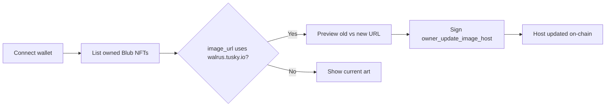

# Blub NFT Image Updater

A small [Sui](https://sui.io) dApp that finds Blub NFTs whose images still point at a dead host and lets the owner update the image URL on-chain.

Some Blub NFTs store `image_url` values on `https://walrus.tusky.io`. That host no longer serves the art, so marketplaces and wallets show a broken image. This app rewrites the host to `https://bucket.blubsui.website`, keeping the same blob id.

Built by [Patara](https://patara.app) / [Notus Labs](https://github.com/notus-labs).

## What it does

1. Connect a Sui wallet (Sui Wallet, Nightly, Suiet, MSafe, Slush, or any other installed Wallet Standard wallet).
2. Load every `Blub` NFT owned by the connected address on Sui mainnet.
3. Flag NFTs whose `image_url` still starts with `https://walrus.tusky.io`.
4. Preview the broken URL next to the new URL (`https://bucket.blubsui.website/<BlobId>`).
5. On **Fix it**, the owner signs one Move call that updates the image host on the NFT object.

NFTs that already use the new host are shown as a gallery. Wallets with no Blub NFTs get an empty state.

The app only changes the image host. It does not transfer the NFT, change attributes, or spend tokens beyond the usual Sui gas fee.

## How it works



Owned objects are loaded over Sui gRPC (`listOwnedObjects` with BCS content), filtered to the Blub type, and decoded locally. A broken NFT is one whose `image_url` starts with the old Tusky Walrus host. The replacement URL is `{new host}/{BlobId}` from the NFT attributes.

Each fix submits:

```text
0x56e430bc0cc42baa5cc5242d914f2de249b5ffeb7a663dc2079de769d077744b::collection::owner_update_image_host
```

Arguments:

| Argument | Value |
| --- | --- |
| NFT object | the Blub object you own |
| new host | `https://bucket.blubsui.website` |

The transaction is simulated, signed in the wallet on `sui:mainnet`, executed, and waited on. After a success, the NFT list is refetched.

## On-chain details

| Item | Value |
| --- | --- |
| Network | Sui mainnet |
| Package | [`0x56e430bc0cc42baa5cc5242d914f2de249b5ffeb7a663dc2079de769d077744b`](https://suiscan.xyz/mainnet/object/0x56e430bc0cc42baa5cc5242d914f2de249b5ffeb7a663dc2079de769d077744b) |
| NFT type | `…::collection::Blub` |
| Entry function | `collection::owner_update_image_host` |
| Broken host | `https://walrus.tusky.io` |
| New host | `https://bucket.blubsui.website` |
| RPC | `https://fullnode.mainnet.sui.io:443` |

Only the NFT owner can call `owner_update_image_host`. The **Fix it** button is disabled if the NFT has no `BlobId` attribute.

## Getting started

### Prerequisites

- [Bun](https://bun.sh/)
- A Sui wallet browser extension (for local use)
- SUI for gas on mainnet

### Install and run

Clone this repository, then:

```bash
bun install
bun run dev
```

Open [http://localhost:3000](http://localhost:3000).

No `.env` file is required. The app talks to Sui mainnet directly from the browser.

### Scripts

| Command | Description |
| --- | --- |
| `bun run dev` | Next.js dev server |
| `bun run build` | Production build |
| `bun run start` | Serve the production build |
| `bun run lint` | ESLint on `./src` |

## Usage

1. Click **Connect Wallet** and approve the connection.
2. Wait for your Blub NFTs to load.
3. If a card shows a broken image on the left and a working preview on the right, click **Fix it**.
4. Approve the transaction in your wallet.
5. After confirmation, the NFT should render from `https://bucket.blubsui.website`.

Unknown routes redirect to `/`.

## Project structure

```text
src/
  pages/index.tsx                          # Home: connect wallet or run the fixer
  modules/portfolio/
    components/blub-image-migration.tsx    # UI + Move call
    functions/fetch-blub-nfts.ts           # gRPC fetch + BCS decode
  modules/wallet/                          # Wallet Standard connect / sign / execute
  context/                                 # Wallet + Sui gRPC client
  components/                              # Layout, header, wallet dialog, UI
```

Stack: Next.js 14 (Pages Router), React 18, TypeScript, Tailwind CSS, TanStack Query, `@mysten/dapp-kit`, and `@mysten/sui`.

## Safety

- This app submits real mainnet transactions. Review the Move call in your wallet before signing.
- It only calls `owner_update_image_host` on Blub NFTs you own.
- There is no backend custody of keys. Signing stays in the wallet.
- Image hosting is provided by the Blub project (`bucket.blubsui.website`). This repo does not host NFT media.

## Contributing

Issues and pull requests are welcome.

1. Fork the repo and create a branch.
2. Keep changes focused on the image-updater flow.
3. Run `bun run lint` before opening a PR.

## License

[MIT](./LICENSE) © Notus Labs
